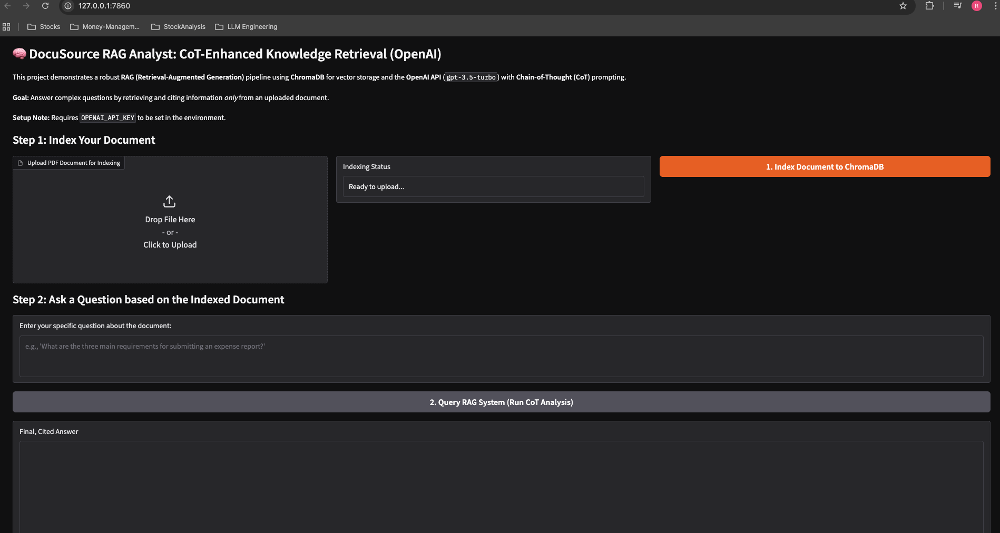
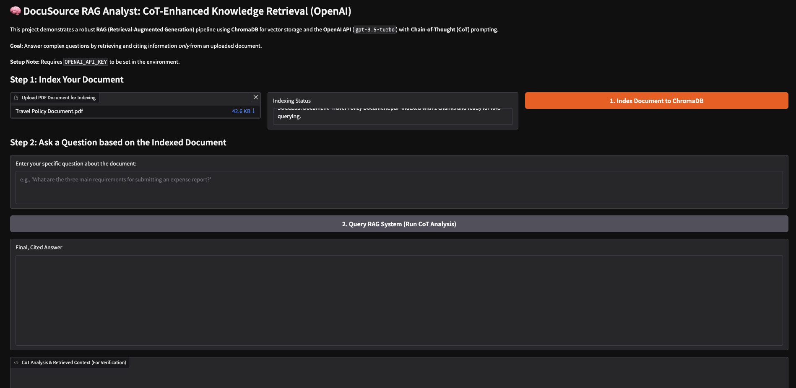
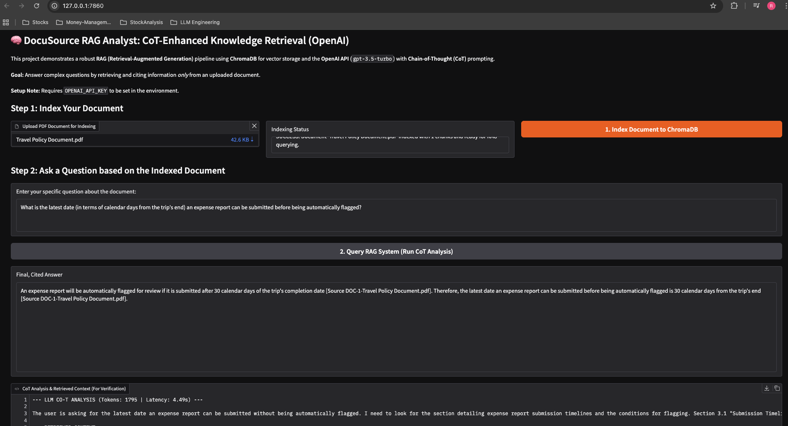

# 🧠 DocuSource RAG Analyst: CoT-Enhanced Knowledge Retrieval

This project implements a Retrieval-Augmented Generation (RAG) system using **Google's Gemini API** for both text embeddings and knowledge generation. It is designed to answer complex questions strictly based on the content of an uploaded PDF document, leveraging a **Chain-of-Thought (CoT)** prompting structure to ensure accurate, verifiable, and cited answers.

The application is built using **Gradio** for an easy-to-use web interface and **ChromaDB** for the vector store, all orchestrated via the native Google GenAI SDK.

---

## ✨ Features

* **Gemini Native Integration:** Uses `gemini-2.5-flash` for high-quality, cited answer generation and `models/text-embedding-004` for document indexing.

* **In-Memory Vector Store:** Employs `chromadb.Client()` for a fast, in-memory RAG experience (**Note:** Indexed data does not persist across application restarts).

* **CoT Prompting:** Enforces a structured response from the LLM, requiring it to output its detailed `THOUGHTS` and a final, distinct `FINAL ANSWER`.

* **Source Citation:** Requires the LLM to cite every factual statement back to the source document chunk for maximum verifiability.

* **Gradio UI:** Provides a simple, two-step interface for indexing documents and querying the system.

---

## 🚀 Setup and Installation

Follow these steps to set up the environment and run the application.

### 1. Prerequisites

* Python 3.9+
* A Gemini API Key (available from [Google AI Studio](https://aistudio.google.com/)).

### 2. Environment Setup

It is highly recommended to use a virtual environment (like Conda or `venv`).

```bash
# Create and activate the conda environment
conda create env -f environment.yaml
conda activate docu-rag
```

### 3. API Key Configuration
Create a file named .env in the root directory of your project and add your Gemini API key:

```bash
GEMINI_API_KEY="YOUR_GEMINI_API_KEY_HERE"
```
Remember to replace the placeholder with your actual key.

### 4. Run the Application
Execute the Python script to launch the Gradio web interface.


```bash
python app.py
```

The application will launch and typically open automatically in your browser (e.g., at http://127.0.0.1:7860).

## 🧑‍💻 How to Use the Application

The Gradio interface is divided into two main steps:

### Step 1: Index Your Document

1.  **Upload:** Click the **"Upload PDF Document for Indexing"** box and select your PDF file.
2.  **Index:** Click the **"1. Index Document to ChromaDB"** button.
3.  **Status:** The "Indexing Status" box will update with a `SUCCESS` message and the number of chunks created.

### Step 2: Ask a Question

1.  **Question:** Enter a specific question related to the content of your indexed PDF in the input textbox.
2.  **Query:** Click the **"2. Query RAG System (Run CoT Analysis)"** button.

### Understanding the Outputs

* **Final, Cited Answer:** The model's final, concise response, strictly based on the indexed document. Look for source citations (e.g., `[Source DOC-1-policy.pdf]`) for verification.
* **CoT Analysis & Retrieved Context:** This section displays the model's **Chain-of-Thought (`THOUGHTS`)** reasoning process and the exact **`RETRIEVED CONTEXT`** chunks pulled from the vector database. This is essential for auditing the RAG system's performance.

## 📸 Screenshots

Below are screenshots demonstrating the application's interface and its final output.

***

### Input Screen

This image displays the user interface where input parameters or data are provided.



***

### Document Uploaded

This image displays the screen after uploading the PDF Document.



***
### Output Screen

This image shows the result or output generated by the application after processing the input.



***