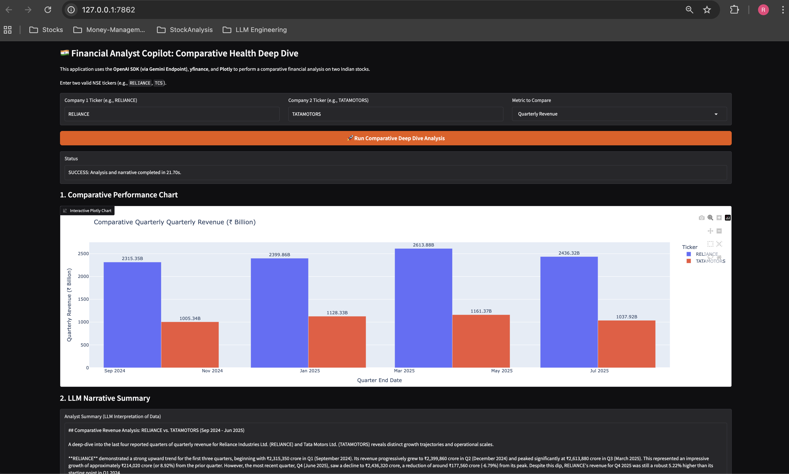

# 🇮🇳 Financial Analyst Copilot: Comparative Health Deep Dive

This application is a specialized **Retrieval-Augmented Generation (RAG)** tool designed for **financial analysis of Indian (NSE) stocks**.  
It goes beyond simple Q&A by performing a **Comparative Financial Health Deep Dive** on two chosen companies.

The system pulls **live, structured financial data**, visualizes it using **Plotly**, and uses a powerful **LLM (Gemini via OpenAI SDK)** to generate a detailed, narrative summary of the findings.

---

## 🚀 Key Features and Tech Stack

| **Component** | **Library / Tool** | **Role** |
|----------------|--------------------|-----------|
| **Data Source** | `yfinance` | Fetches live historical and quarterly financial data for Indian stocks (automatically appends `.NS`). |
| **Data Handling** | `pandas` | Structures and cleans the time-series financial data for both charting and LLM prompting. |
| **Visualization** | `Plotly` | Generates interactive, embedded charts for visual comparison of key metrics. |
| **Generation** | `openai SDK + Gemini 2.5 Flash` | Interprets the structured data and generates a professional, narrative analyst summary. |
| **Interface** | `Gradio` | Provides the two-ticker, single-metric web application interface. |

---

## ⚙️ Setup and Installation

### 1. Prerequisites

- Python **3.11+**
- A **Gemini API Key**

---

### 2. Environment Setup

Use the provided `environment.yml` file for a clean setup.

```bash
# Create and activate the conda environment
conda env update --file environment.yml
conda activate financial-copilot-rag
```
## 📸 Screenshots

Below is the  screenshot demonstrating the application's interface and its final output.

