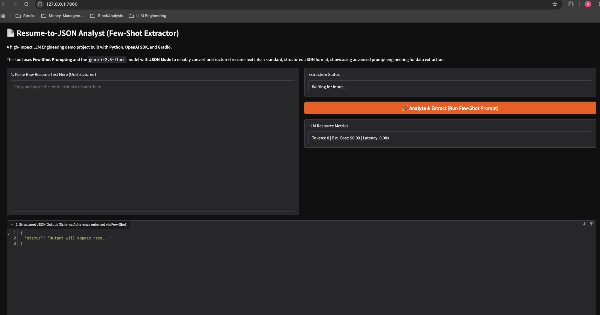
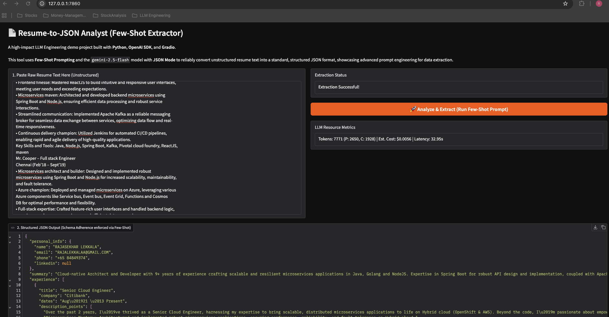

# 📄 Resume-to-JSON Analyst (Few-Shot Extractor)

## Project Overview
This project is a high-impact demonstration of **LLM Engineering** skills, specifically focusing on **Few-Shot Prompting** for reliable, structured data extraction. It solves the real-world problem of converting highly unstructured resume text into a standard, machine-readable JSON format, a critical step for automated Applicant Tracking Systems (ATS).

The entire application is built using **Python**, the **OpenAI SDK**, and **Gradio** for a clean, shareable web interface.

## 🛠️ Technology Stack & Core Techniques

| Component | Technology | Role |
| :--- | :--- | :--- |
| **LLM Core Technique** | **Few-Shot Prompting** | **Demonstrates robustness and consistency** by providing the LLM with an example input/output pair to force adherence to the strict JSON schema. |
| **Structured Output** | **OpenAI `response_format={"type": "json_object"}`** | Guarantees the output is valid JSON, a key production-ready feature. |
| **Programming Language** | Python 3.11+ | The industry standard for LLM applications. |
| **LLM SDK** | `openai` | Used for interfacing with the `gemini-2.5-flash` model. |
| **User Interface** | Gradio | Enables rapid creation and sharing of the web application. |

## 🚀 Getting Started

### Prerequisites
1.  **Conda/Mamba** installed.
2.  An **GEMINI API Key**.

### Setup Instructions

1.  **Clone the Repository:**
    ```bash
    git clone [https://github.com/YourUsername/resume-llm-extractor.git](https://github.com/YourUsername/resume-llm-extractor.git)
    cd resume-llm-extractor
    ```

2.  **Create & Activate Environment:**
    ```bash
    conda env create -f environment.yaml
    conda activate resume-llm-extractor
    ```

3.  **Set API Key:**
    Create a file named `.env` in the project root and add your key:
    ```
    # .env file
    GEMINI_API_KEY="xxxxxxxxxxxxxxxxxxxxxxxxxxxxxxxxxxxxxxxx"
    ```

4.  **Run the Application:**
    ```bash
    python app.py
    ```
    The application will launch in your browser at `http://localhost:7860`.

## ⚙️ Core Engineering (`app.py` Highlight)

The high-quality results are achieved by meticulously crafting the LLM call within the `process_input` function, which adheres to the required function signature:

```python
from typing import Dict, Any

def process_input(user_input: str) -> Dict[str, Any]:
    """
    Takes raw resume text and uses a few-shot prompt (embedded 
    in the system message) to extract structured data into a 
    dictionary/JSON object, utilizing JSON Mode for reliable output.
    """
    # ... few-shot prompt construction (see app.py) ...
    
    response = client.chat.completions.create(
        model="gemini-2.5-flash",
        response_format={"type": "json_object"}, 
        # The Few-Shot logic is contained in the messages array
        messages=[
            {"role": "system", "content": system_prompt},
            {"role": "user", "content": user_prompt}
        ]
    )
    
    # ... cost and token calculation ...
    
    # Return a dictionary containing structured output, status, and metrics
    return {
        "error": "Extraction Successful!", 
        "json_output": json.dumps(parsed_json, indent=2),
        "token_info": token_info
    }
```
## 📸 Screenshots

Below are screenshots demonstrating the application's interface and its final output.

***

### Input Screen

This image displays the user interface where input parameters or data are provided.



***

### Output Screen

This image shows the result or output generated by the application after processing the input.



***