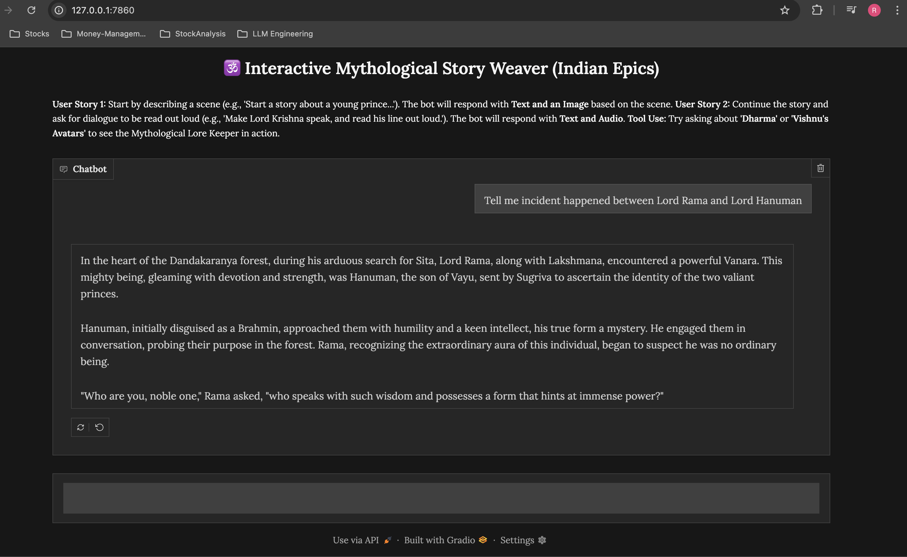

# 🕉️ Interactive Mythological Story Weaver

The **Interactive Mythological Story Weaver** is a conversational, **multimodal chatbot** built with **Gradio** and **Gemini APIs** (via the **OpenAI Python SDK**) that collaboratively generates imaginative short stories centered around **Indian mythologies** — such as *Ramayana*, *Mahabharata*, and tales of *Vishnu*, *Mahadev*, *Brahma*, and more.

It showcases a robust **Tool-Use pattern**, **Image Generation**, and **Text-to-Speech (TTS)** conversion — all integrated into a single conversational interface.

---

## 🌟 Key Features

### 1. Multimodal Narrative Generation

The application provides an engaging, mixed-media storytelling experience based on the conversational context.

| **Feature** | **Trigger** | **Output** | **API Used** |
|--------------|-------------|-------------|---------------|
| **Scene Visualization (Image)** | Explicit request on the first turn (e.g., “Start a story…”) | Generated image of the scene | `imagen-3.0-generate-002` |
| **Dialogue Audio (TTS)** | Explicit request to speak (e.g., “read it out loud”, “make Lord Krishna speak”) | Playable `.wav` audio file of the dialogue | `gemini-2.5-flash-preview-tts` |

---

### 2. 🧙‍♂️ The Lore Keeper (Custom Tool-Use)

The application integrates a custom tool, `lore_keeper_lookup`, which simulates fetching **critical world-building rules** from a fictional mythology database.

```python
def lore_keeper_lookup(topic: str):
    """
    Simulates fetching mythological references or spiritual rules.
    Example: lore_keeper_lookup("Dharma") -> returns essence of Dharma from Vedas.
    """
```

## 🧙‍♂️ Role

If the user asks the bot to incorporate concepts like **“Dharma”** or **“Krishna’s Vows”**,  
the **Gemini model** recognizes the need for external lore data, calls this tool,  
and uses the returned knowledge to craft a consistent narrative segment aligned  
with the mythology’s core principles.

---

## 🧠 Core Technology Stack

| **Component** | **Library / API** | **Purpose** |
|----------------|------------------|--------------|
| **Conversational UI** | `Gradio ChatInterface` | Manages chat turns and multimodal message display. |
| **LLM & Tool Orchestration** | `OpenAI Python SDK (Gemini API)` | Handles conversational reasoning, function calling, and context memory. |
| **Multimodality** | `requests` | Direct API calls to Imagen (for image generation) and Gemini TTS (for audio synthesis). |

---

## 🛠️ Setup and Installation

### Prerequisites

- Python **3.8+**  
- A valid **Gemini API Key**

---

### Environment Setup

You will need the following Python libraries.  
It’s recommended to use a **virtual environment** (like Conda) to manage dependencies.

```bash
# Create and activate a virtual environment
conda create -n story-weaver python=3.11
conda activate story-weaver
```

## ▶️ Running the Application

After setting up the environment and configuring your Gemini API key, launch the app:

```bash
python app.py
```

## 🪔 Example Interaction

**You:**  
> Start a story about Lord Rama meeting Hanuman for the first time.

**App:**  
🖼️ *(Generates an image of the meeting scene)*  
📖 *Narrates a vivid, contextually accurate story with lore details fetched via `lore_keeper_lookup`.*  
🔊 *Plays TTS audio of the dialogue between Rama and Hanuman.*

---

## 🧩 Key Design Highlights

- **Dynamic Function Calling:** Gemini model intelligently invokes `lore_keeper_lookup` for mythological consistency.  
- **Multimodal Output:** Produces text, image, and audio within a single chat flow.  
- **Extendable Framework:** You can easily add new tools (e.g., `verse_translator`, `battle_visualizer`, or `epic_poetry_mode`).  
- **Conversational Memory:** Gemini retains narrative coherence across multiple turns.


---

## 🧠 Conceptual Workflow

```text
User Prompt → Gemini LLM → (optional) lore_keeper_lookup() → Narrative Generation
     ↓
Scene Request → Imagen API → Image Output
     ↓
Audio Request → Gemini TTS → WAV Audio Output
     ↓
→ Displayed in Gradio ChatInterface
```

## 🪄 Example Lore Lookup Outputs

| **Topic**         | **Sample `lore_keeper_lookup` Response**                                                                 |
|--------------------|----------------------------------------------------------------------------------------------------------|
| **Dharma**         | "Dharma is the eternal order that sustains the universe — truth, righteousness, and duty in harmony."    |
| **Krishna's Vows** | "Krishna vowed not to wield weapons during the Kurukshetra war, upholding divine neutrality."            |
| **Trimurti**       | "Brahma creates, Vishnu preserves, and Mahesh (Shiva) transforms the cosmos in cyclical balance."        |

## 📸 Screenshots

Below is the  screenshot demonstrating the application's interface and its final output.

